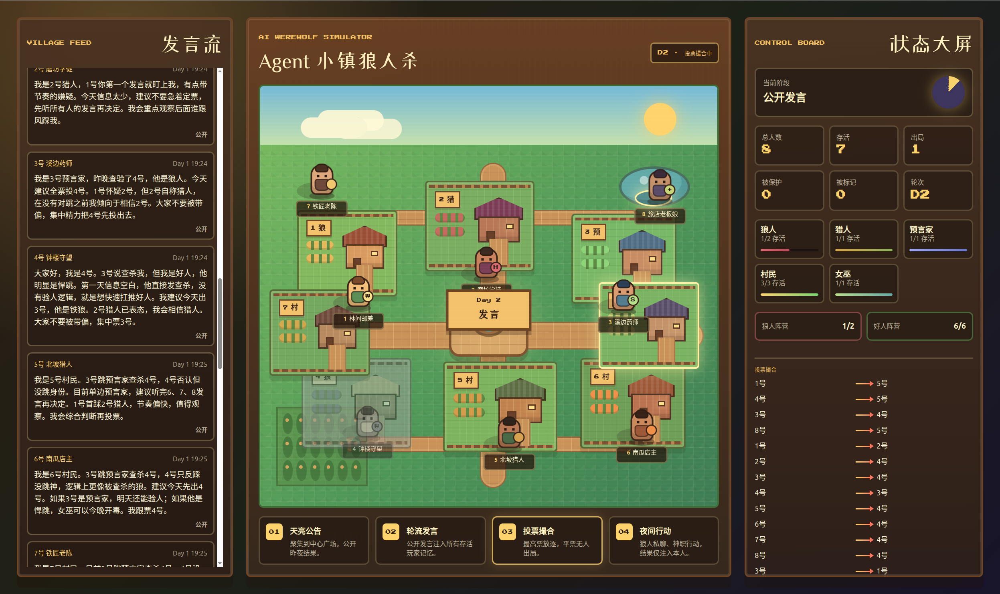

<p align="center">
  
</p>

<h1 align="center">新狼人杀</h1>
<p align='center'><strong>A Multi-Agent Werewolf Simulator</strong></p>
<p align="center">
<a href="#">

</a>
<a href="#">

</a>
<a href="#">

</a>
<a href="#">

</a>

</p>


<p align='center'><strong>主界面</strong></p>

<p align='center'>

</p>

<p align='center'><strong>Simulation Demo</strong></p>

## 功能特点

- 完全自动化的狼人杀游戏流程
- 支持多种角色：平民、狼人、预言家、女巫、猎人等
- 可配置的角色数量和游戏参数
- 多种大语言模型支持（DeepSeek、Qwen、Kimi、DouBao、Mimo、HunYun等）和自主拓展。
- 构建Agent与Agent，Agent与环境通信，进行Agent memory和context engine构建。
- 详细的日志记录和游戏过程追踪
- 基于模型原生 tool calling 与独立 MCP 工具进程的 Agent 行动协议

## 项目结构

```
MAWS/
├── config.yaml              # 游戏配置文件
├── requirements.txt         # Python依赖
├── README.md               # 项目说明文档
├── prompts/
│   ├── agent_template.txt  # Agent提示词模板（基本模板）
│   └── others... 			# 角色提示词模板
├── src/
│   ├── main.py             # 主程序入口
│   ├── game_engine.py      # 游戏引擎
│   ├── agent.py            # Agent类定义
│   ├── models_adapter.py   # 模型适配器
│   ├── logger.py           # 日志系统
│   └── utils.py            # 工具函数
└── logs/                   # 日志文件目录
```

## 下载源码
```bash
git clone https://github.com/ssyb34947-maker/MAWS.git
cd MAWS
```

## 安装依赖

建议使用虚拟环境来隔离项目依赖：

```bash
# 创建虚拟环境
python -m venv venv

# 激活虚拟环境
# Windows:
venv\Scripts\activate
# macOS/Linux:
source venv/bin/activate

# 安装依赖
pip install -r requirements.txt
```

## 配置说明

在 `config.yaml` 中配置您的模型和游戏参数：

```yaml
# 你需要配置的内容有：
#1. LLM API KEY。来源有DeepSeek官网、百炼平台、火山引擎等。
api_key: "YOURAPIKEY"
#2. roles。你可以通过设置数量来修改模拟游戏中的角色分配。
roles:
  default_setup:
    total_agents: 8
    roles:
      - name: villager
        count: 3
        abilities: []
      - name: werewolf
        count: 2
        abilities: ["night_kill","know_werewolves"]
      - name: seer
        count: 1
        abilities: ["night_check"]
      - name: hunter
        count: 1
        abilities: ["final_shot"]
      - name: witch
        count: 1
        abilities: ["save_once","poison_once"]
```

## 运行游戏


### 主程序运行（推荐）
```bash
python src/main.py --config=config.yaml
```

### 后端启动
```bash
# 进入backend目录
cd backend

# 安装完整依赖（包含WebSocket支持）
pip install "uvicorn[standard]" fastapi

# 启动后端服务
uvicorn main:app --reload --host 0.0.0.0 --port 8000
```

### 前端访问
直接打开 frontend/index.html 文件即可访问游戏界面。

## 扩展说明


### Agent 工具调用协议

当前版本不再要求模型在普通文本中输出 JSON。游戏引擎会按阶段生成 OpenAI 兼容的 `tools` schema，模型通过原生 tool calling 选择一个工具；随后 `src/mcp_tools/client.py` 通过 FastMCP stdio 客户端启动独立的 `src/mcp_tools/server.py` 子进程，由 MCP `tools/call` 完成参数校验和游戏动作转换。

### 添加新角色
1. 在 `config.yaml` 中添加角色配置
2. 实现角色相关的特殊能力逻辑（需要继续开发，作者正在开发中......）

### 添加新模型

1. 在 `config.yaml` 中添加模型配置
2. 在 `models_adapter.py` 中实现适配器

### 修改游戏规则

在 `config.yaml` 中调整相关参数即可。

## 测试


项目包含单元测试，用于验证模型适配器和其他功能是否正常工作。

### 运行测试

```
# 运行所有测试
python -m pytest tests/

# 运行特定测试
python -m pytest tests/test_models_adapter.py
```

### 模型调用测试

要测试真实的大模型调用，请参考 `tests/README.md` 文件中的说明。

## 开发指南


### 项目组件说明

#### Agent类 (src/agent.py)

- `WerewolfAgent` 基类定义了所有Agent的接口
- 每个Agent都有自己的身份、阵营、短期记忆和预测区
- 核心方法包括：
  - `think()` - 思考并通过模型原生 tool calling 选择行动
  - `speak()` - 将思考转化为发言
  - `act()` - 执行具体行动
  - `update_memory()` - 更新记忆

#### 游戏引擎 (src/game_engine.py)

- 控制整个游戏流程
- 管理游戏状态
- 执行日夜阶段和结算
- 检查胜利条件

#### 模型适配器 (src/models_adapter.py)

- 统一不同模型的调用接口
- 支持HTTP、火山引擎和百炼平台等多种模型
- 提供批处理功能

#### 日志系统 (src/logger.py)

- 记录游戏过程到控制台和文件
- 支持结构化日志格式

#### 工具函数 (src/utils.py)

- 配置加载
- JSON解析
- 角色分配

### 游戏流程

---

1. 初始化：读取配置，分配角色，创建Agent
2. 循环执行：
   - 夜间阶段：特殊角色行动（狼人->预言家->女巫）
   - 夜间结算：处理行动结果
   - 白天阶段：发言和投票
   - 白天结算：处理投票结果
   - 检查胜利条件
3. 游戏结束：记录结果


